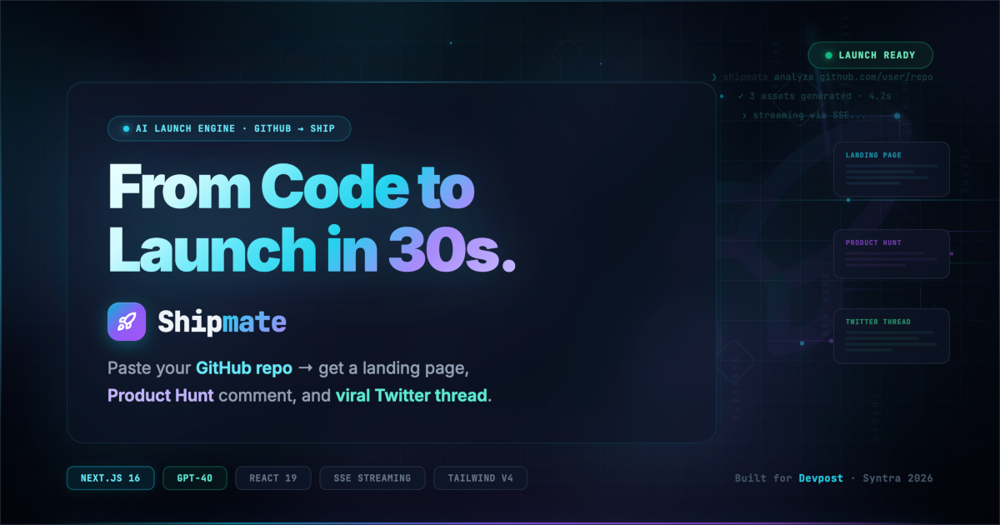
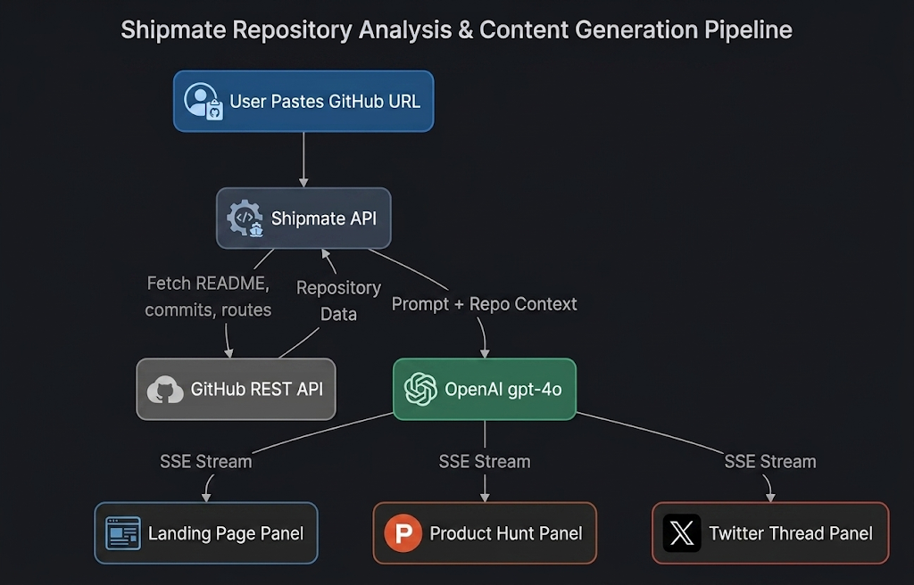

<div align="center">
  <a href="https://shipmate.edycu.dev/">
    
  </a>
  <br/>
  <h1>🚢 Shipmate</h1>
  <p><em>Paste your GitHub repo → get a landing page, Product Hunt comment, and viral Twitter thread. From code to launch in 30 seconds.</em></p>
  
  <p align="center">
    
    
    
    
  </p>
  <p align="center">
    
    
  </p>

  <a href="https://shipmate.edycu.dev/"></a>
  <a href="https://youtu.be/QJSom_BLiRM"></a>
</div>

---

## 📸 See it in Action
*(Demo showing the simultaneous AI generation of three marketing assets streaming via SSE)*

### 1. Landing Page to Dashboard Flow


### 2. Edge Case: Full-Stack Web3 & AI Integration


### 3. Edge Case: Offline Multimodal AI


### 4. Edge Case: Pure Python CLI Script


## 💡 The Problem & Solution

Every developer has been here: you just spent 48 hours building something incredible. Then you hit a wall. You stare at a blank Google Doc to write your landing page copy, or write a terrible "I built a thing" tweet. **The gap between "I built it" and "people know about it" kills more startups than bad code.**

**Shipmate** solves this by autonomously reading your codebase and writing your launch materials for you.

**Key Features:**
- 🏠 **Code-Aware Landing Page:** Generates a hero headline, feature blocks, and CTA based on your actual tech stack and recent commits. Export as HTML.
- 🚀 **Product Hunt Comment Generator:** Follows the proven maker launch format (problem → solution → ask) that gets upvotes.
- 🐦 **Viral Twitter Thread:** Generates a 5-part technical build narrative from your GitHub commit history.
- ⚡ **Simultaneous Streaming:** All three launch assets stream side-by-side in real-time. No loading spinners, full visual spectacle.

## 🏗️ Architecture & Tech Stack
We built the frontend using **Next.js 16 (App Router)** and **Tailwind CSS v4**. Code analysis uses the **GitHub REST API**, and generation is handled by **OpenAI gpt-4o** using real-time Server-Sent Events (SSE) streaming for immediate visual feedback.



## 🏆 Sponsor Tracks Targeted

* **Primary Track**: Build a product using Syntra — Developer Tools / SaaS
* **Syntra Excellence**: Shipmate itself was built entirely using Syntra! It's a meta-recursive project: Shipmate can generate a "Built with Syntra" case study from its own repository. See the `SYNTRA_USAGE.md` file in the repo for exact prompt logs and time savings. We successfully demonstrated "From Prompt to Product to Profit".

## 🚀 Run it Locally (For Judges)

1. **Clone the repo:** `git clone https://github.com/edycutjong/shipmate.git`
2. **Install dependencies:** `npm install`
3. **Set up environment variables:** 
   ```bash
   cp .env.example .env.local
   ```
   Add your `OPENAI_API_KEY` and personal `GITHUB_TOKEN` to `.env.local`.
4. **Run the app:** `npm run dev`

> **Note for Judges:** 
> You can skip making an account! There is zero authentication required. The app is fully self-contained. Simply paste any public GitHub URL and click "Analyze"!

## 📄 License

MIT © 2026 [Edy Cu](https://github.com/edycutjong)
