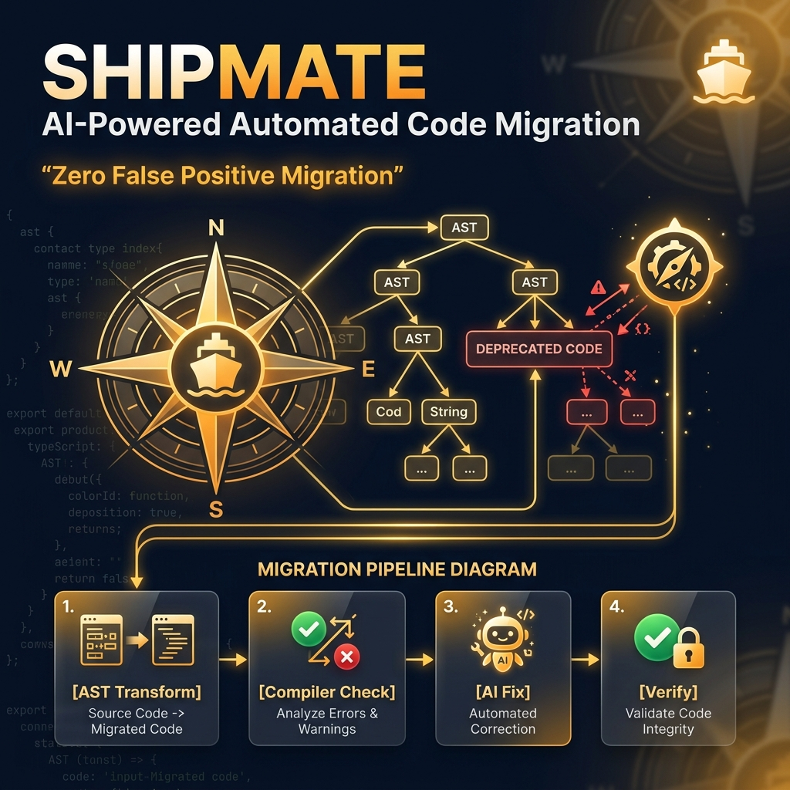
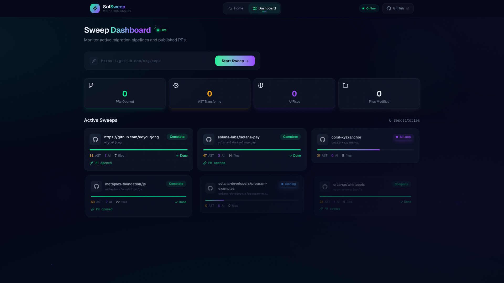
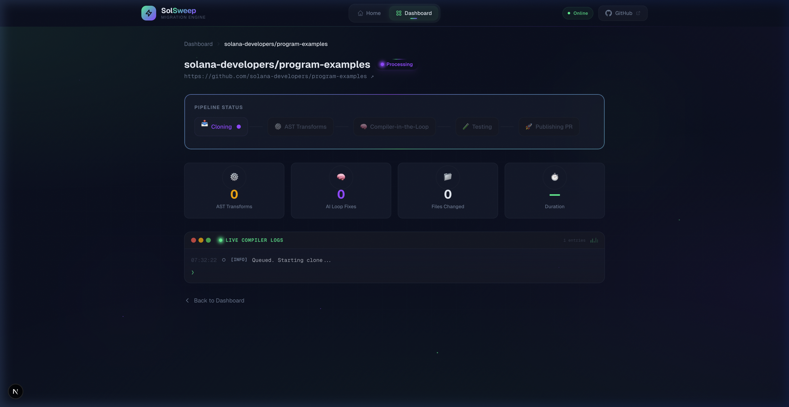
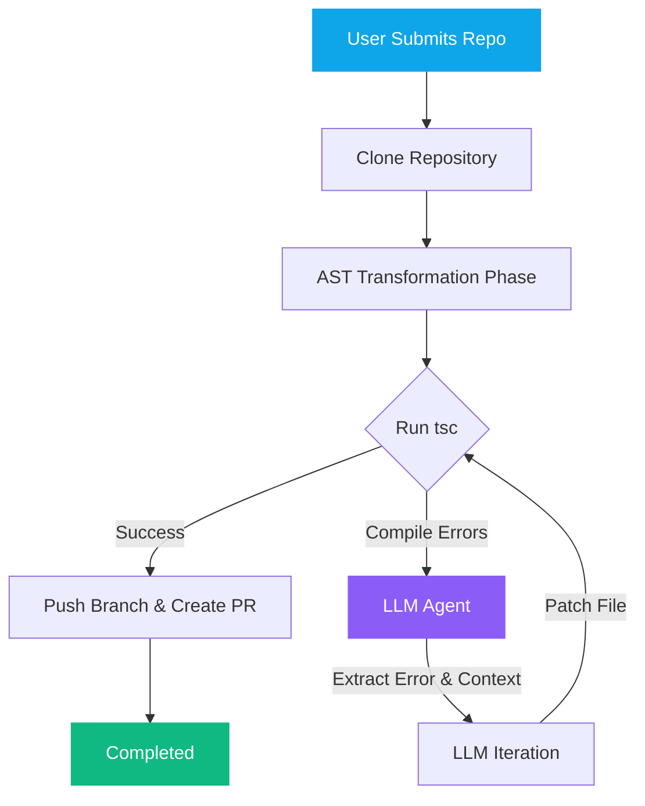

<p align="center">
  <a href="https://shipmate.edycu.dev/">
    
  </a>
</p>

<h1 align="center">Shipmate</h1>
<p align="center"><strong>Zero-FP Solana Migrations</strong></p>

<p align="center">
  
  
  
  
</p>
<p align="center">
  
  
</p>
<p align="center">
  <a href="https://shipmate.edycu.dev/"></a>
  <a href="https://youtu.be/ApeRnzYuN7U"></a>
</p>

> Autonomous AST codemods verified by an adversarial AI-compiler loop. Open live PRs on real repos with **zero false positives**.

Shipmate is an autonomous migration engine built for the **[DoraHacks Boring AI Hackathon 2026](https://dorahacks.io/hackathon/boring-ai)**. It upgrades legacy Solana codebases from `@solana/web3.js` to the modern `@solana/kit` standard — combining deterministic AST transforms with a compiler-in-the-loop AI for edge cases that mechanical regex can't handle.

<table>
  <tr>
    <td width="50%" align="center">
      
      <br/>
      <em>Dashboard — Real-time sweep monitoring</em>
    </td>
    <td width="50%" align="center">
      
      <br/>
      <em>Sweep Detail — 4-stage pipeline visualization</em>
    </td>
  </tr>
</table>

---

## 🎯 Problem

The #1 problem with AI code generation is **false positives**: hallucinations that introduce subtle syntax errors, forcing developers to manually debug the "fixes." This defeats the purpose of automation.

Solana's migration from `@solana/web3.js` to `@solana/kit` affects thousands of open-source repositories. Manual migration takes hours per repo. AI-only migration produces broken code. Neither approach works at scale.

## 💡 Solution

**Shipmate** takes a radically different approach: **compiler-verified AI migration.**

1. **AST Codemods** — Deterministic `ast-grep` transforms via the Codemod toolkit handle 80% of migration patterns (imports, types, method calls)
2. **Compiler-in-the-Loop** — `tsc` errors from the remaining 20% are fed to Claude Sonnet, which patches edge cases iteratively until the build is **mathematically proven green**
3. **Auto-PR** — The verified branch is pushed and a Pull Request is opened automatically

**Key features:**
- **4-stage pipeline visualization** — Clone → AST Codemod → Compiler Loop → Ship PR
- **Real-time log terminal** — Watch the background worker steps as they happen
- **Live GitHub PR links** — Every successful migration ends with a clickable PR URL
- **Dashboard analytics** — Track total PRs, active sweeps, and success rates via Supabase

---

## 🏗️ Architecture

Shipmate uses an event-driven loop architecture combining deterministic codemods with LLM verification:



**1. AST Transformation (`ast-grep`)**  
Bulk transforms deterministic patterns like simple import changes and parameter reordering. This phase is fast and guarantees zero hallucinations because it relies on standard AST parsers.

**2. The Compiler Loop**  
After bulk transformation, the engine runs the TypeScript compiler (`tsc`). If the build fails, the raw compiler errors, exact file locations, and structural context are fed into a large language model (Claude Sonnet) via streaming AI functions.

**3. Verification**  
The AI attempts to fix the isolated typing issues. The compiler is run again. This loop continues iteratively until either the types are solved and the build succeeds, or a maximum recursive boundary matches.

---

## 🛠️ Tech Stack

| Layer       | Technology                          |
| ----------- | ----------------------------------- |
| Framework   | Next.js 16.2.3 (App Router)         |
| UI          | React 19.2.4                        |
| Styling     | Tailwind CSS v4 + CSS custom props  |
| Backend     | Supabase (sweep tracking + stats)   |
| AST Engine  | ast-grep / Codemod toolkit + tsc    |
| AI          | Claude Sonnet (edge case fixes) |
| Language    | TypeScript 5                        |

---

## 🚀 Getting Started

### Prerequisites

- **Node.js** ≥ 18
- **npm** ≥ 9

### Installation

```bash
git clone https://github.com/edycutjong/shipmate.git
cd shipmate
npm install
```

### Environment Variables

Create a `.env.local` file in the project root:

```env
# Supabase (optional — falls back to demo mode)
NEXT_PUBLIC_SUPABASE_URL=https://your-project-id.supabase.co
NEXT_PUBLIC_SUPABASE_ANON_KEY=your-anon-key-here

# GitHub - Needed for creating branches and PRs
GITHUB_TOKEN=your-github-personal-access-token

# OpenAI - Needed for compiler-in-the-loop AI processing
OPENAI_API_KEY=your-openai-api-key
```

> **Note:** The app runs fully in demo mode without any environment variables. The pipeline visualization and log terminal use simulated data for a reliable demo experience.

### Run Development Server

```bash
npm run dev
```

Open [http://localhost:3000](http://localhost:3000) to see the landing page.

---

## 📁 Project Structure

```
shipmate/
├── src/
│   ├── app/
│   │   ├── api/              # API routes for sweep operations
│   │   ├── dashboard/        # Sweep dashboard + detail views
│   │   ├── globals.css       # Design tokens + animations
│   │   ├── layout.tsx        # Root layout with metadata
│   │   └── page.tsx          # Hero landing page
│   ├── components/
│   │   ├── Header.tsx        # Navigation header
│   │   ├── PipelineStatus.tsx # 4-stage progress visualization
│   │   └── LogTerminal.tsx   # Real-time log output terminal
│   └── lib/
│       ├── supabase.ts       # Supabase client
│       └── types.ts          # TypeScript interfaces
├── docs/                     # Documentation assets
│   ├── DEMO_SCRIPT.md        # 2-minute demo recording script
│   ├── CASE_STUDY.md         # Full background and context
│   └── screenshots/          # App screenshots
├── codemod/                  # Shipmate's core codemod plugin package
├── package.json
├── tsconfig.json
└── next.config.ts
```

---

## 🎨 Demo Flow

1. **Landing Page** — Animated hero with live code preview cycling through migration steps
2. **Dashboard** — Click "Launch Dashboard" → see total PRs and active sweeps
3. **Start Migration** — Paste a GitHub URL → click "Start Migration"
4. **Pipeline Viz** — Watch Clone → AST → Compiler Loop → PR stages light up in sequence
5. **Log Terminal** — See real-time logs including `[AI] Compiler-Loop: Feeding error TS2322 to Claude Sonnet...`
6. **PR Result** — Green "View Pull Request" button links to the opened PR

---

## 🏆 Hackathon Context

**Competition:** [Boring AI Hackathon 2026](https://dorahacks.io/hackathon/boring-ai)  
**Track:** Case Studies / Production-grade Upgrade Recipes  
**Core Thesis:** AI migrations are broken because LLMs hallucinate syntax. By constraining the AI to only fix compiler-verified errors (not generate code from scratch), Shipmate achieves **zero false positives** — making it genuinely "boring" in the best possible way.

> 📄 **Read the Full Case Study:** [CASE_STUDY.md](./docs/CASE_STUDY.md) covers our AST + compiler-in-the-loop implementation in depth.
> 🎬 **Demo Materials:** [DEMO_SCRIPT.md](./docs/DEMO_SCRIPT.md) contains the video flow & pitch.

---

## 📄 License

MIT © 2026 [Edy Cu](https://github.com/edycutjong)
